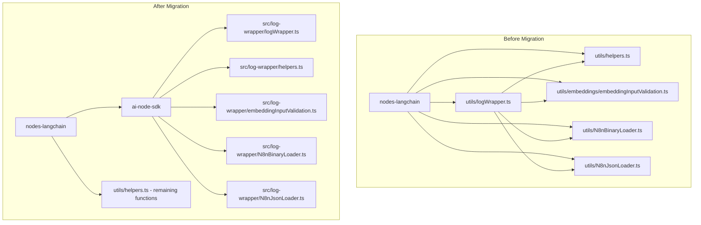

# Plan: Move logWrapper to ai-node-sdk Package

## Overview

Move `logWrapper.ts` and all related helpers from `packages/@n8n/nodes-langchain/utils/` to `packages/@n8n/ai-node-sdk/src/` and update all references.

## Analysis Summary

### Files to Move

1. **`logWrapper.ts`** - Main file containing:
   - `callMethodAsync<T>()` - Async method wrapper with error handling
   - `callMethodSync<T>()` - Sync method wrapper with error handling
   - `logWrapper<T>()` - Proxy wrapper for logging AI operations

2. **`embeddings/embeddingInputValidation.ts`** - Used by logWrapper:
   - `validateEmbedQueryInput()` - Validates query input for embedQuery operations
   - `validateEmbedDocumentsInput()` - Validates documents input for embedDocuments operations

3. **Helper functions from `helpers.ts`** (only the ones used by logWrapper):
   - `logAiEvent()` - Logs AI events
   - `isToolsInstance()` - Type guard for Tool instances
   - `isBaseChatMemory()` - Type guard for BaseChatMemory
   - `isBaseChatMessageHistory()` - Type guard for BaseChatMessageHistory

4. **`N8nBinaryLoader.ts`** - Referenced in logWrapper type constraints
5. **`N8nJsonLoader.ts`** - Referenced in logWrapper type constraints

### Files That Import logWrapper (49 files)

All imports use `@utils/logWrapper` path alias:

```
packages/@n8n/nodes-langchain/nodes/code/Code.node.ts
packages/@n8n/nodes-langchain/nodes/retrievers/RetrieverMultiQuery/RetrieverMultiQuery.node.ts
packages/@n8n/nodes-langchain/nodes/retrievers/RetrieverVectorStore/RetrieverVectorStore.node.ts
packages/@n8n/nodes-langchain/nodes/retrievers/RetrieverContextualCompression/RetrieverContextualCompression.node.ts
packages/@n8n/nodes-langchain/nodes/retrievers/RetrieverWorkflow/RetrieverWorkflow.node.ts
packages/@n8n/nodes-langchain/nodes/vector_store/VectorStorePineconeLoad/VectorStorePineconeLoad.node.ts
packages/@n8n/nodes-langchain/nodes/vector_store/VectorStoreZepLoad/VectorStoreZepLoad.node.ts
packages/@n8n/nodes-langchain/nodes/vector_store/VectorStoreInMemoryLoad/VectorStoreInMemoryLoad.node.ts
packages/@n8n/nodes-langchain/nodes/vector_store/shared/createVectorStoreNode/operations/retrieveAsToolOperation.ts
packages/@n8n/nodes-langchain/nodes/vector_store/shared/createVectorStoreNode/operations/retrieveOperation.ts
packages/@n8n/nodes-langchain/nodes/vector_store/VectorStoreSupabaseLoad/VectorStoreSupabaseLoad.node.ts
packages/@n8n/nodes-langchain/nodes/mcp/McpClientTool/McpClientTool.node.ts
packages/@n8n/nodes-langchain/nodes/document_loaders/DocumentJSONInputLoader/DocumentJsonInputLoader.node.ts
packages/@n8n/nodes-langchain/nodes/document_loaders/DocumentGithubLoader/DocumentGithubLoader.node.ts
packages/@n8n/nodes-langchain/nodes/document_loaders/DocumentDefaultDataLoader/DocumentDefaultDataLoader.node.ts
packages/@n8n/nodes-langchain/nodes/document_loaders/DocumentBinaryInputLoader/DocumentBinaryInputLoader.node.ts
packages/@n8n/nodes-langchain/nodes/text_splitters/TextSplitterTokenSplitter/TextSplitterTokenSplitter.node.ts
packages/@n8n/nodes-langchain/nodes/text_splitters/TextSplitterCharacterTextSplitter/TextSplitterCharacterTextSplitter.node.ts
packages/@n8n/nodes-langchain/nodes/text_splitters/TextSplitterRecursiveCharacterTextSplitter/TextSplitterRecursiveCharacterTextSplitter.node.ts
packages/@n8n/nodes-langchain/nodes/memory/MemoryMotorhead/MemoryMotorhead.node.ts
packages/@n8n/nodes-langchain/nodes/memory/MemoryBufferWindow/MemoryBufferWindow.node.ts
packages/@n8n/nodes-langchain/nodes/memory/MemoryZep/MemoryZep.node.ts
packages/@n8n/nodes-langchain/nodes/memory/MemoryMongoDbChat/MemoryMongoDbChat.node.ts
packages/@n8n/nodes-langchain/nodes/memory/MemoryPostgresChat/MemoryPostgresChat.node.ts
packages/@n8n/nodes-langchain/nodes/memory/MemoryXata/MemoryXata.node.ts
packages/@n8n/nodes-langchain/nodes/memory/MemoryRedisChat/MemoryRedisChat.node.ts
packages/@n8n/nodes-langchain/nodes/embeddings/EmbeddingsOpenAI/EmbeddingsOpenAi.node.ts
packages/@n8n/nodes-langchain/nodes/embeddings/EmbeddingsMistralCloud/EmbeddingsMistralCloud.node.ts
packages/@n8n/nodes-langchain/nodes/embeddings/EmbeddingsLemonade/EmbeddingsLemonade.node.ts
packages/@n8n/nodes-langchain/nodes/embeddings/EmbeddingsHuggingFaceInference/EmbeddingsHuggingFaceInference.node.ts
packages/@n8n/nodes-langchain/nodes/embeddings/EmbeddingsGoogleGemini/EmbeddingsGoogleGemini.node.ts
packages/@n8n/nodes-langchain/nodes/embeddings/EmbeddingsGoogleVertex/EmbeddingsGoogleVertex.node.ts
packages/@n8n/nodes-langchain/nodes/embeddings/EmbeddingsCohere/EmbeddingsCohere.node.ts
packages/@n8n/nodes-langchain/nodes/embeddings/EmbeddingsAzureOpenAi/EmbeddingsAzureOpenAi.node.ts
packages/@n8n/nodes-langchain/nodes/embeddings/EmbeddingsAwsBedrock/EmbeddingsAwsBedrock.node.ts
packages/@n8n/nodes-langchain/nodes/embeddings/EmbeddingsOllama/EmbeddingsOllama.node.ts
packages/@n8n/nodes-langchain/nodes/tools/ToolThink/ToolThink.node.ts
packages/@n8n/nodes-langchain/nodes/tools/ToolWolframAlpha/ToolWolframAlpha.node.ts
packages/@n8n/nodes-langchain/nodes/tools/ToolCalculator/ToolCalculator.node.ts
packages/@n8n/nodes-langchain/nodes/tools/ToolVectorStore/ToolVectorStore.node.ts
packages/@n8n/nodes-langchain/nodes/tools/ToolSearXng/ToolSearXng.node.ts
packages/@n8n/nodes-langchain/nodes/tools/ToolSerpApi/ToolSerpApi.node.ts
packages/@n8n/nodes-langchain/nodes/tools/ToolWikipedia/ToolWikipedia.node.ts
packages/@n8n/nodes-langchain/nodes/rerankers/RerankerCohere/RerankerCohere.node.ts
```

### Files That Import logAiEvent (separate from logWrapper)

These files import `logAiEvent` directly from `@utils/helpers`:

```
packages/@n8n/nodes-langchain/nodes/vector_store/shared/createVectorStoreNode/operations/insertOperation.ts
packages/@n8n/nodes-langchain/nodes/vector_store/shared/createVectorStoreNode/operations/updateOperation.ts
packages/@n8n/nodes-langchain/nodes/vector_store/shared/createVectorStoreNode/operations/retrieveAsToolExecuteOperation.ts
packages/@n8n/nodes-langchain/nodes/vector_store/shared/createVectorStoreNode/operations/loadOperation.ts
packages/@n8n/nodes-langchain/utils/output_parsers/N8nStructuredOutputParser.ts
packages/@n8n/nodes-langchain/utils/output_parsers/N8nOutputFixingParser.ts
packages/@n8n/nodes-langchain/nodes/llms/N8nNonEstimatingTracing.ts
packages/@n8n/nodes-langchain/nodes/llms/N8nLlmTracing.ts
```

### Dependencies Required for ai-node-sdk

The following dependencies need to be added to `@n8n/ai-node-sdk/package.json`:

```json
{
  "dependencies": {
    "@langchain/community": "catalog:",
    "@langchain/core": "catalog:",
    "@langchain/openai": "catalog:",
    "@langchain/textsplitters": "catalog:",
    "@langchain/classic": "catalog:",
    "n8n-workflow": "workspace:*",
    "tmp-promise": "3.0.3"
  },
  "devDependencies": {
    "@types/mime-types": "catalog:"
  }
}
```

## Implementation Steps

### Phase 1: Create Files in ai-node-sdk

1. **Create `src/log-wrapper/` directory structure:**
   ```
   packages/@n8n/ai-node-sdk/src/
   ├── log-wrapper/
   │   ├── index.ts
   │   ├── logWrapper.ts
   │   ├── callMethodAsync.ts
   │   ├── callMethodSync.ts
   │   ├── embeddingInputValidation.ts
   │   ├── helpers.ts (logAiEvent, isToolsInstance, isBaseChatMemory, isBaseChatMessageHistory)
   │   ├── N8nBinaryLoader.ts
   │   └── N8nJsonLoader.ts
   └── index.ts (re-export everything)
   ```

2. **Update `package.json`** with required dependencies

3. **Update `tsconfig.json`** to include proper references

4. **Export all entities from `src/index.ts`**

### Phase 2: Update nodes-langchain

1. **Add `@n8n/ai-node-sdk` as dependency** in `package.json`

2. **Update all imports** from `@utils/logWrapper` to `@n8n/ai-node-sdk`:
   - Change: `import { logWrapper } from '@n8n/ai-node-sdk';`
   - To: `import { logWrapper } from '@n8n/ai-node-sdk';`

3. **Update imports of logAiEvent** from `@utils/helpers` to `@n8n/ai-node-sdk`:
   - Change: `import { logAiEvent } from '@utils/helpers';`
   - To: `import { logAiEvent } from '@n8n/ai-node-sdk';`

4. **Update imports of N8nBinaryLoader and N8nJsonLoader**:
   - Change: `import { N8nBinaryLoader } from '@utils/N8nBinaryLoader';`
   - To: `import { N8nBinaryLoader } from '@n8n/ai-node-sdk';`

5. **Keep remaining helpers in nodes-langchain** that are not used by logWrapper:
   - `getMetadataFiltersValues()`
   - `isChatInstance()`
   - `getPromptInputByType()`
   - `getSessionId()`
   - `serializeChatHistory()`
   - `escapeSingleCurlyBrackets()`
   - `getConnectedTools()`
   - `unwrapNestedOutput()`
   - `hasLongSequentialRepeat()`

### Phase 3: Cleanup

1. **Remove moved files from nodes-langchain:**
   - `utils/logWrapper.ts`
   - `utils/embeddings/embeddingInputValidation.ts`
   - `utils/N8nBinaryLoader.ts`
   - `utils/N8nJsonLoader.ts`

2. **Update `helpers.ts`** to remove moved functions (logAiEvent, isToolsInstance, isBaseChatMemory, isBaseChatMessageHistory)

3. **Update test mocks** in test files that mock `@utils/logWrapper`

### Phase 4: Verification

1. Run `pnpm typecheck` in both packages
2. Run `pnpm lint` in both packages
3. Run `pnpm test` in both packages
4. Run full build to verify everything works

## Mermaid Diagram



## Risk Assessment

1. **Circular Dependencies**: Need to ensure no circular dependencies are introduced between packages
2. **Type Compatibility**: The generic types in logWrapper are complex and need careful handling
3. **Test Mocks**: Several test files mock `@utils/logWrapper` and will need updates
4. **Path Aliases**: The `@utils/*` path alias in nodes-langchain needs to be preserved for remaining utils

## Notes

- The `N8nBinaryLoader` and `N8nJsonLoader` classes have dependencies on `getMetadataFiltersValues` from helpers.ts. This function should remain in nodes-langchain and be passed as a parameter or the loaders should be refactored to not depend on it.
- Alternative approach: Keep `N8nBinaryLoader` and `N8nJsonLoader` in nodes-langchain and only move the type references needed for logWrapper's generic constraints.
